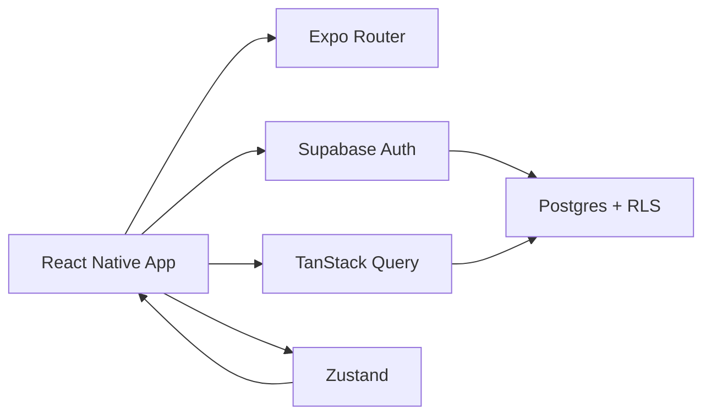
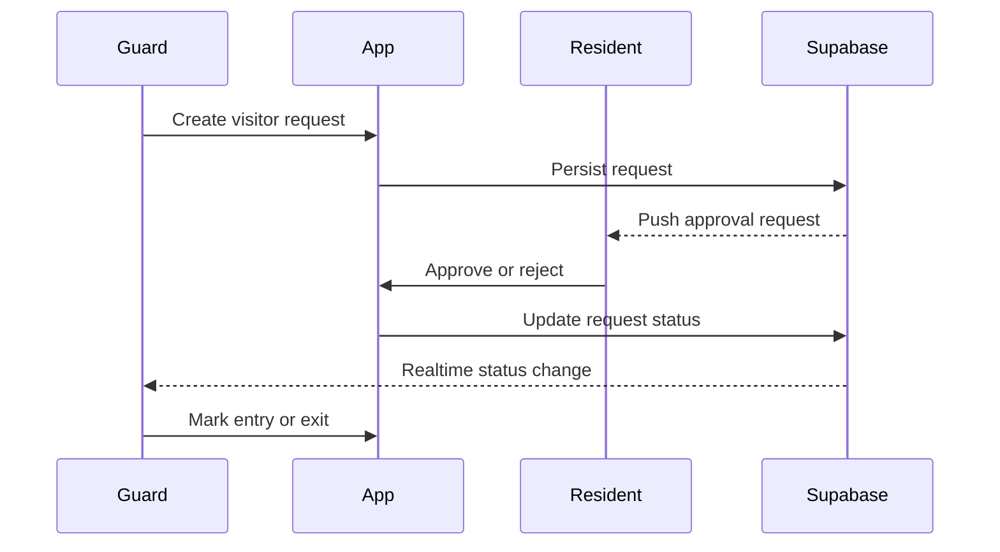

# Portl

Portl is a mobile-first apartment society management application for Android built with Expo, React Native, TypeScript, Expo Router, Supabase, and React Native Paper.

## Product overview
Portl replaces gate calls, WhatsApp approvals, paper visitor registers, manual complaint tracking, and fragmented community workflows with one secure mobile application for residents, security guards, and society admins.

## Problem statement
Apartment communities still rely on manual coordination at the gate and scattered messaging tools. The result is delays, missed approvals, unclear visitor records, and poor accountability.

## Solution
Portl provides a role-aware experience where:
- residents approve or reject visitors from their phone,
- guards register visitors and mark entry/exit,
- admins coordinate community operations from a shared dashboard.

## Main features
- secure authentication and session restoration,
- visitor approval workflow with real-time updates,
- resident community modules for complaints, notices, polls, amenities, and maintenance,
- guard operations for visitor registration and gate management,
- admin operations for property, people, complaints, amenities, notices, polls, and maintenance,
- push notification infrastructure and Android support.

## User roles
- Resident
- Security Guard
- Society Admin

## Technology stack
- Expo
- React Native
- TypeScript
- Expo Router
- React Native Paper
- React Hook Form + Zod
- TanStack Query
- Zustand
- Supabase
- Expo Notifications

## Architecture overview


## Database overview
The backend schema uses Supabase PostgreSQL with RLS and server-authorized RPC functions for visitor approvals, entry/exit, bookings, voting, and complaint transitions.

## Visitor approval sequence


## Prerequisites
- Node.js 20+
- npm
- Expo CLI
- A Supabase project
- Android emulator or physical device

## Installation
```bash
npm install
cp .env.example .env
```

## Environment variables
- EXPO_PUBLIC_SUPABASE_URL
- EXPO_PUBLIC_SUPABASE_PUBLISHABLE_KEY
- EXPO_PUBLIC_EAS_PROJECT_ID

## Supabase setup
Create a Supabase project, enable Auth, storage, and Realtime, and configure the environment variables above.

## Migration commands
This repository is scaffolded for the next implementation phases and will include migration files under the Supabase folder once the schema is added.

## Seed instructions
Seed data for GreenView Residency and demo accounts will be added in the Supabase seed script in a later phase.

## Running on Android
```bash
npm start
```

## Push-notification setup
Android push notifications use Expo Notifications and require Firebase Cloud Messaging credentials in a later production setup step.

## Testing
```bash
npm run typecheck
npm run lint
npm test
npm run doctor
```

## APK build instructions
```bash
eas build --platform android --profile preview
```

## Demo credentials
- Resident: resident@portl.demo / Resident@123
- Guard: guard@portl.demo / Guard@123
- Admin: admin@portl.demo / Admin@123

## Security decisions
- Client never stores service-role credentials.
- Sensitive transitions are enforced on the server through RLS-backed server functions.
- Role and society checks are derived from the authenticated user.

## Project structure
- app/
- components/
- lib/
- services/
- stores/
- types/
- supabase/

## Known limitations
This phase establishes the Expo shell, routing, theme, and core app structure. The Supabase-backed vertical slice and production database schema are planned for subsequent phases.

## Future improvements
- full Supabase migrations and seed data,
- real-time visitor flows,
- admin and guard role experiences,
- notification dispatch via Edge Functions,
- Android build signing and EAS release automation.

## Demo-video link placeholder
[Demo Video](https://drive.google.com/file/d/1w61TJ2s_u8VZezhW6n2eFNm-U_eQE3al/view?usp=sharing)
